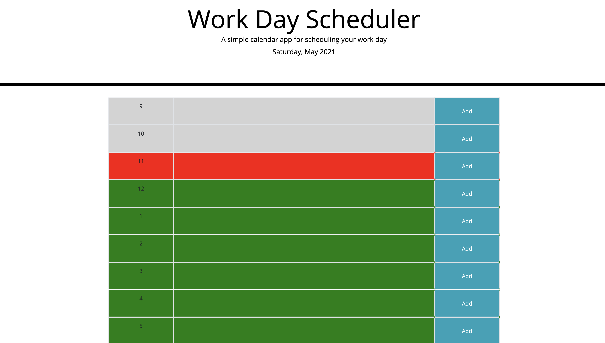

# Day-Planner

&#x2611; When the user refreshes the page after typing their planes, the content stays on the page. (See screenshot-1)
 
&#x2611; Added easy to use buttons that allows to pick and choose what time-slot to save information in.
 
&#x2611; Color-coded the time-slots to make user aware if the time they are choosing is in the past, present, or in the future.
 

